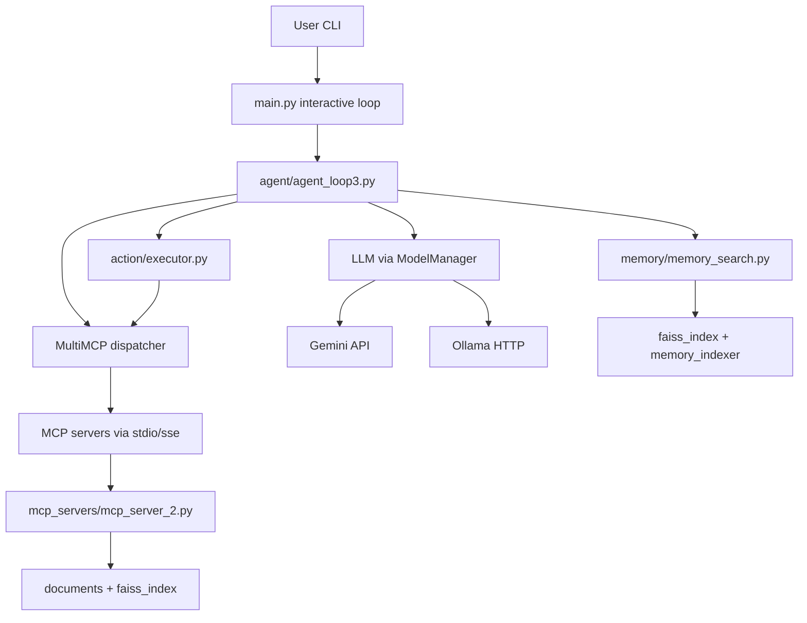
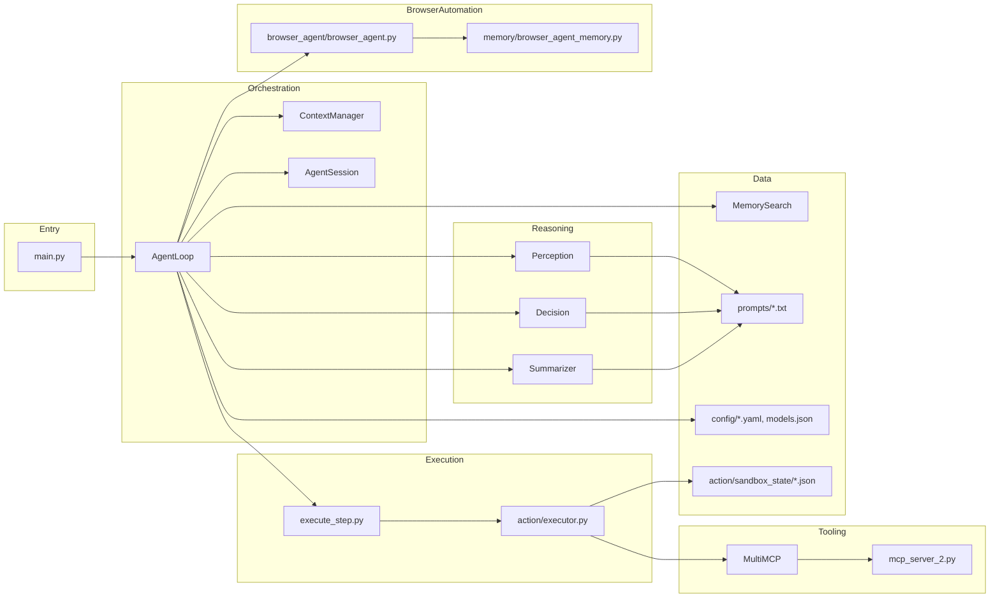
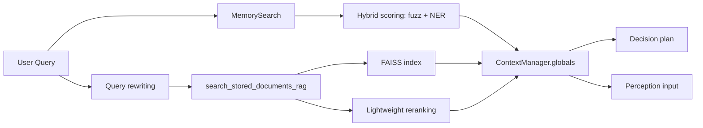
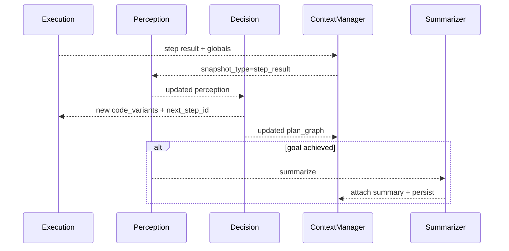
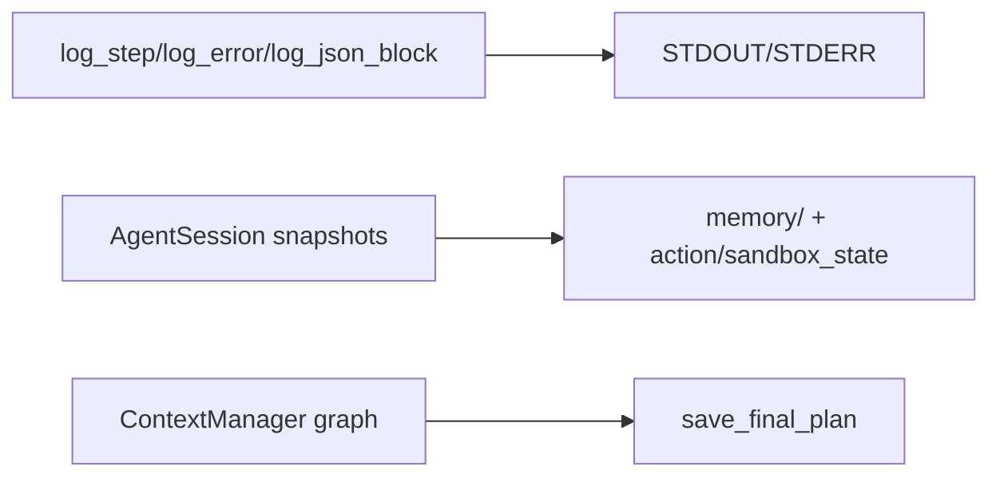
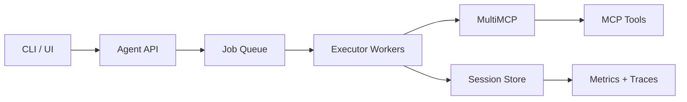
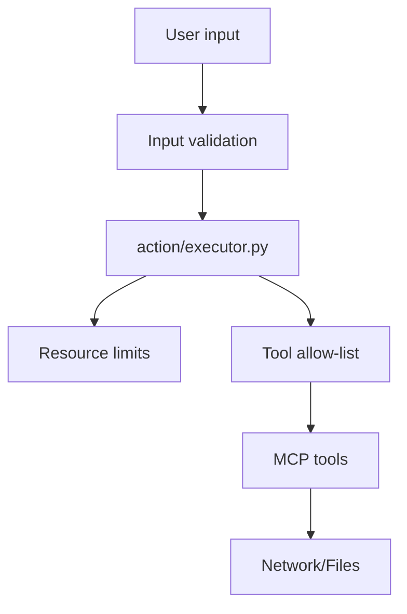
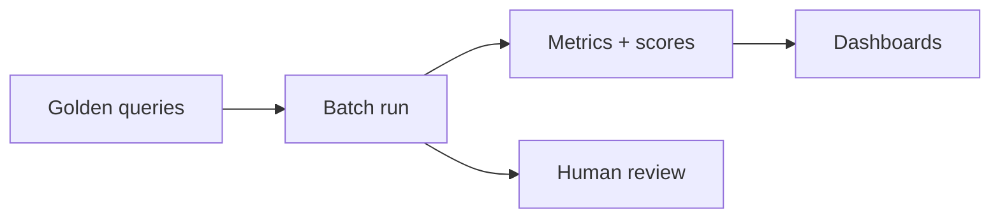
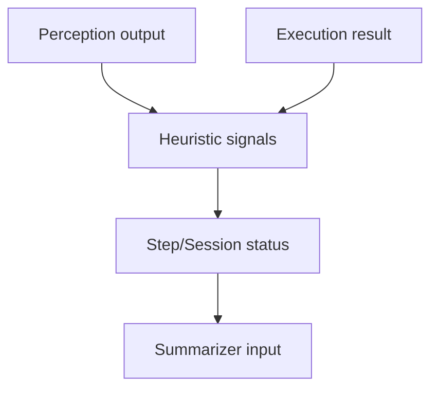
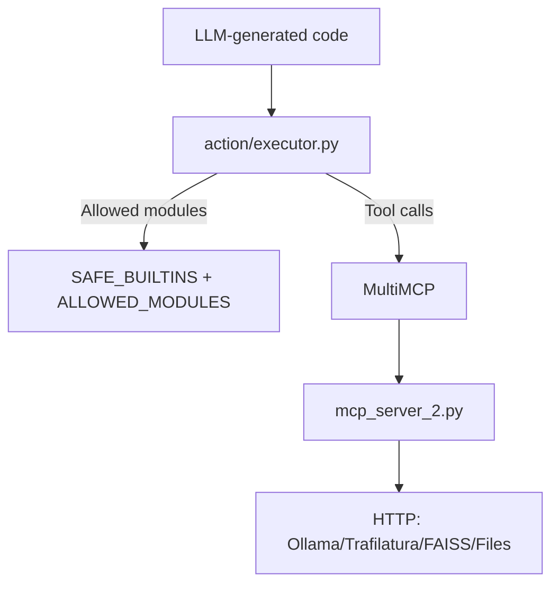

# Architecture

This document summarizes the architecture and runtime flow of the S12 agent.

## System Context


## Component Breakdown


## BrowserAgent Upgrades
- **LLM-guided element ranking:** ranks similar interactive elements before click/input.
- **Visited page memory:** tracks visited page hashes and failed actions to avoid loops.
- **Form flow chaining:** follows multi-stage forms across redirects and submit steps.
- **Persistent state:** saved under `memory/browser_agent_state/` per run/session.

## Core Runtime Flow
```mermaid
sequenceDiagram
  participant User
  participant Main
  participant Loop as AgentLoop
  participant BA as BrowserAgent
  participant BM as BrowserMemory
  participant Perc as Perception
  participant Dec as Decision
  participant Exec as Executor
  participant MCP as MultiMCP
  participant Tool as MCP Tool
  participant Sum as Summarizer

  User->>Main: enter query
  Main->>Loop: run(query)
  Loop->>Perc: build_perception_input + run()
  Perc-->>Loop: perception output
  Loop->>Dec: build_decision_input + run()
  Dec-->>Loop: plan_graph + code_variants
  Loop->>Exec: execute_step_with_mode
  Exec->>BA: run(instruction)
  BA->>BM: load_state(session_id or run_id)
  BA->>MCP: get_interactive_elements / call tool
  MCP-->>BA: result
  BA->>BM: save_state(updated_memory)
  Exec->>MCP: function_wrapper(tool)
  MCP->>Tool: call tool
  Tool-->>MCP: result
  MCP-->>Exec: result
  Exec-->>Loop: step result
  Loop->>Perc: perception on step_result
  Perc-->>Loop: updated perception
  alt goal achieved
    Loop->>Sum: summarize()
    Sum-->>Loop: final summary
  else continue
    Loop->>Dec: replan/next step
  end
```

## Data Flow
```mermaid
flowchart TD
  Query[User Query] --> PInput[build_perception_input]
  PInput --> Perception
  Perception --> POut[Perception JSON]
  POut --> DInput[build_decision_input]
  DInput --> Decision
  Decision --> Plan[plan_graph + code_variants]
  Plan --> Execute[execute_step_with_mode]
  Execute --> BA[BrowserAgent]
  BA --> BM[BrowserMemoryStore]
  BM --> BA
  Execute --> Results[step result + globals update]
  Results --> PInput2[build_perception_input(step_result)]
  PInput2 --> Perception

  Results --> Context[ContextManager graph/globals]
  Context --> SummaryInput
  SummaryInput --> Summarizer
  Summarizer --> FinalAnswer
```

## Retrieval Intelligence


## Memory Stratification
```mermaid
graph TD
  Raw[Raw inputs & outputs] --> Session[AgentSession snapshots]
  Session --> ShortTerm[ContextManager.globals + plan graph]
  Raw --> LongTerm[Memory index (faiss)]
  LongTerm --> Recall[MemorySearch]
  Recall --> ShortTerm
```

## Feedback + Learning Loop


## Observability + Evaluation


## Failure Handling + Recovery
- **Step failures:** `StepExecutionTracker` limits retries per step and forces a replan to `ROOT` after repeated failures.
- **Tool timeouts:** timeouts trigger a bounded retry; if repeated, the loop replans from `ROOT`.
- **Planner failures:** invalid or erroring Decision output retries a limited number of times, then summarizes partial results.
- **Retrieval failures:** retrieval-related errors return a clarification request to the user.
- **Early summarize:** Perception can route to summarizer when goals are met or further steps are unhelpful.

## Scaling Plan

- **Split processes:** separate agent API, MCP servers, and indexer services.
- **Queue execution:** move `execute_step` to background workers.
- **Cache retrieval:** memoize RAG results by query + corpus hash.
- **Batch indexing:** periodic embeddings, avoid reindex on startup.

## Hardening Plan

- **Sandbox limits:** reduce `SAFE_BUILTINS`, tighten `ALLOWED_MODULES`, enforce memory/CPU/time limits.
- **Tool allow-list:** scope tools to task category; deny network/file side effects by default.
- **Secrets:** move API keys to a secret manager; rotate regularly.
- **Audit trail:** append immutable logs for decisions, tool calls, and errors.

## Evaluation Plan

- **Golden set:** fixed tasks with expected outputs for regression.
- **Heuristic signals:** track `original_goal_achieved`, retry counts, tool error rates.
- **Retrieval metrics:** recall@k, MRR, source coverage.
- **Cost + latency:** per-step timing and model cost.

## Explicit Evaluation Signals

- **Heuristic examples:** completion flags (`original_goal_achieved`, `local_goal_achieved`), route switching, retry limits, and error states.
- **Why it matters:** these signals gate summarization, replanning, and termination.

## Safety / Trust Boundaries


## Responsibilities Summary
- `main.py` wires config, initializes `MultiMCP`, and runs the interactive loop.
- `agent/agent_loop3.py` orchestrates perception -> decision -> execution -> perception.
- `agent/contextManager.py` stores plan graph, globals, and step state.
- `agent/agentSession.py` stores snapshots for observability and replay.
- `action/executor.py` runs sandboxed tool-calling code.
- `mcp_servers/mcp_server_2.py` provides local RAG tools (FAISS + document parsing).

## Minor Reasoning Role Clarification
- **Perception:** interprets state and decides whether to summarize or continue.
- **Decision:** creates/updates the plan graph and tool-calling code variants.
- **Summarizer:** composes the final response when goal is achieved.
